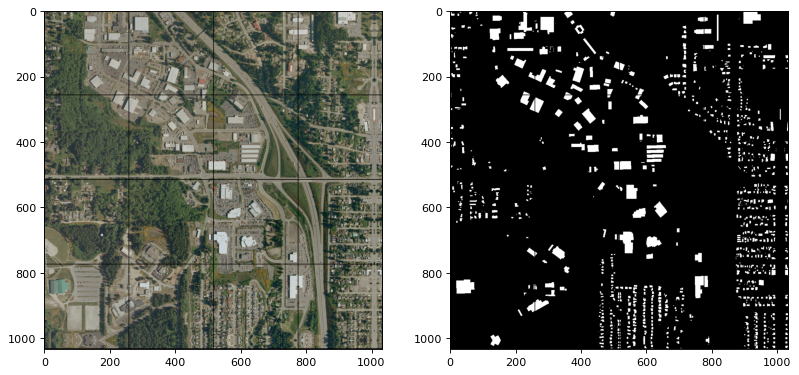

# Split Raster

[](https://python.org/pypi/splitraster)
[](https://python.org/pypi/splitraster)
[](https://github.com/cuicaihao/split_raster/actions/workflows/python-CI.yml)
[](https://github.com/cuicaihao/split_raster/actions/workflows/python-CD.yml)
[](https://pepy.tech/project/splitraster)
[](https://pepy.tech/project/splitraster)
[](https://python.org/pypi/splitraster)


- Document: [splitraster](https://cuicaihao.github.io/split_raster/)
- Pypi: [splitraster](https://pypi.org/project/splitraster/)


## Introduction

Split Raster is an open-source and highly versatile Python package designed to easily break down large images into smaller, more manageable tiles. While the package is particularly useful for deep learning and computer vision tasks, it can be applied to a wide range of applications.

Initially developed by the authoer to provide optimal support for deep learning and computer vision tasks, Split Raster was specifically designed for image segmentation tasks on satellite images as well as remote sensing methods. By generating tiled output image samples from an input raster dataset, Split Raster enables more efficient and effective analysis of large images. The package also includes a random sampling function that generates a fixed number of tiles for early experimentation.

For example, let's say you have a set of RGB and GT images, each with dimensions of 1000-by-1000 pixels. Utilizing Split Raster, you can easily generate 16 tiles, each with dimensions of 256x256 pixels and automatic padding on the edges. The package also allows for customization of tile size and overlap to better suit individual project needs. Furthermore, Split Raster handles the padding and naming of output images automatically, saving time and effort (e.g., 0001.png, 0002.png, ..., 9999.png).



## Tutorial to generate the above sample image

Open the notebook [SplitRaster Tutorial](notebooks/Tutorial.ipynb).

This tutorial will show you how to use the package to split a large image into small tiles. So you can use the small tiles for your deep learning and computer vision tasks.

[`pytorch`](https://pytorch.org/) is used in this tutorial. You can also use `tensorflow` or other deep learning frameworks.

## Install the packages

```bash
pip install splitraster
```

## Try Sample code 

The sample image can be found in the GitHub repo.

```python

from splitraster import io

input_image_path = "./data/raw/RGB.png"
gt_image_path = "./data/raw/GT.png"

save_path = "../data/processed/RGB"
save_path_gt = "./data/processed/GT"

crop_size = 256
repetition_rate = 0.5
overwrite = False

n = io.split_image(input_image_path, save_path, crop_size,
                   repetition_rate=repetition_rate, overwrite=overwrite)
print(f"{n} tiles sample of {input_image_path} are added at {save_path}")


n = io.split_image(gt_image_path, save_path_gt, crop_size,
                   repetition_rate=repetition_rate, overwrite=overwrite)
print(f"{n} tiles sample of {gt_image_path} are added at {save_path_gt}")


```

Possible results:

```bash
Successfully installed splitraster-0.*.*
❯ python test.py
Input Image File Shape (H, W, D):(1000, 1000, 3)
crop_size=256, stride=128
Padding Image File Shape (H, W, D):(1024, 1024, 3)
There are 49 files in the ./data/processed/RGB
New image name will start with 50
Generating: 100%|█████████████████████████████████████████████████████████████| 49/49 [00:00<00:00, 50.65img/s]
49 tiles sample of ./data/raw/RGB.png are added at ./data/processed/RGB
Input Image File Shape (H, W, D):(1000, 1000)
crop_size=256, stride=128
Padding Image File Shape (H, W, D):(1024, 1024)
There are 49 files in the ./data/processed/GT
New image name will start with 50
Generating: 100%|████████████████████████████████████████████████████████████| 49/49 [00:00<00:00, 139.72img/s]
49 tiles sample of ./data/raw/GT.png are added at ./data/processed/GT
```
 
Check Notebook for Details: [Tutorial](notebooks/Tutorial.ipynb)


## GIS TIFF Image

You can also work with Remote Sensing (GeoTIFF) Satellite images such as Multispectral Images which have more bands or channels. All the codes will be the same, but with a small difference. Replace the `io` with the `geo` module.

This feature also needs you to install the `gdal` package with the following command in your python environment.

This package is not in the required packages due to many users may not use this function. 

However, if you do, please consider create the conda environment as follows for your application.

```bash
conda create -n split_raster_py310 python=3.10 -y
conda activate split_raster_py310
conda install gdal -y
conda install ipykernel -y
pip install --upgrade pip
pip install splitraster
```

On a Mac, you can install these using Homebrew:
```bash
brew install gdal
```
then, you can install the Python GDAL package:

```bash
pip install GDAl
```
Please note that installing GDAL can be complex due to its system dependencies. If you encounter issues, you may need to consult the GDAL documentation or seek help from the community.


Sample Code:

```Python
from splitraster import geo
input_image_path = "./data/raw/Input.tif"
gt_image_path = "./data/raw/GT.tif"

save_path = "../data/processed/Input"
crop_size = 256
repetition_rate = 0.5
overwrite = False

n = geo.split_image(input_image_path, save_path, crop_size,
                   repetition_rate=repetition_rate, overwrite=overwrite)
print(f"{n} tiles sample of {input_image_path} are added at {save_path}")
```

Check Notebook for Details: [Tutorial_II](notebooks/Tutorial_II.ipynb)


## Random Sampling Code

The basic implementation is still the same as the above. Just replace the 'split_image' method to 'rand_crop_image'.

```python
from splitraster import io
input_image_path = "./data/raw/RGB.png"
gt_image_path = "./data/raw/GT.png"

input_save_path = "./data/processed/Rand/RGB"
gt_save_path = "./data/processed/Rand/GT"

n = io.random_crop_image(input_image_path, input_save_path,  gt_image_path, gt_save_path, crop_size=256, crop_number=20, img_ext='.png', label_ext='.png', overwrite=True)

print(f"{n} sample paris of {input_image_path, gt_image_path} are added at {input_save_path, gt_save_path}.")

```

```python
from splitraster import geo
input_tif_image_path = "./data/raw/TIF/RGB5k.tif"
gt_tif_image_path = "./data/raw/TIF/GT5k.tif"

input_save_image_path = "./data/processed/Rand/RGB_TIF"
gt_save_image_path = "./data/processed/Rand/GT_TIF"

n = geo.random_crop_image(input_tif_image_path, input_save_image_path,  gt_tif_image_path, gt_save_image_path, crop_size=500, crop_number=20, overwrite=True)

print(f"{n} sample paris of {input_tif_image_path, gt_tif_image_path} are added at {input_save_image_path, gt_save_image_path}.")

```

## Contribution Guidelines

If you run into issues or have questions, please [open an issue](https://github.com/cuicaihao/split_raster/issues) or [submit a pull request](https://github.com/cuicaihao/split_raster/pulls).

If you are interested in contributing to `splitraster`, please see our [contributing guidelines](../CONTRIBUTING.md).
  
<p><small>Project based on the <a target="_blank" href="https://drivendata.github.io/cookiecutter-data-science/">cookiecutter data science project template</a>. #cookiecutterdatascience</small></p>
