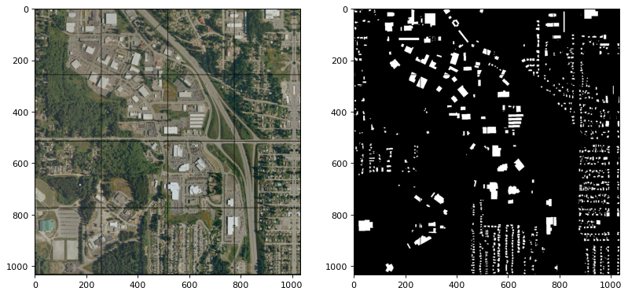

# Split Raster

[](https://python.org/pypi/splitraster)
[](https://python.org/pypi/splitraster)
[](https://github.com/cuicaihao/split_raster/actions/workflows/python-app.yml)
[](https://python.org/pypi/splitraster)
[](https://python.org/pypi/splitraster)

## Introduction

Split Raster is a python package to split a large image into small tiles. It is useful for deep learning and computer vision tasks. The package can also be used to split a large image into small tiles for other applications.

The initial version of the package is developed by Chris to provide good support for deep learning and computer vision tasks on Satelite Images by creating tiled output image samples from an input raster dataset.

Here is a sample image pairs, the size of RGB and GT are 1000-by-1000 large. The `SplitRaster` package successfully generate 16 256x256 images tiles with automatic padding on the edges. You can adjust the tile size and the overlap of the tiles for your own applications.




## Use the packages

```bash
pip install splitraster
```

## Try Sample code

The sample image can be found in the GitHub repo.

```python

from splitraster import io

input_image_path = "./data/raw/RGB.png"
gt_image_path = "./data/raw/GT.png"

save_path = "../data/processed/RGB"
save_path_gt = "./data/processed/GT"

crop_size = 256
repetition_rate = 0.5
overwrite = False

n = io.split_image(input_image_path, save_path, crop_size,
                   repetition_rate=repetition_rate, overwrite=overwrite)
print(f"{n} tiles sample of {input_image_path} are added at {save_path}")


n = io.split_image(gt_image_path, save_path_gt, crop_size,
                   repetition_rate=repetition_rate, overwrite=overwrite)
print(f"{n} tiles sample of {gt_image_path} are added at {save_path_gt}")


```

Possible results:

```bash
Successfully installed splitraster-0.*.*
❯ python test.py
Input Image File Shape (H, W, D):(1000, 1000, 3)
crop_size=256, stride=128
Padding Image File Shape (H, W, D):(1024, 1024, 3)
There are 49 files in the ./data/processed/RGB
New image name will start with 50
Generating: 100%|█████████████████████████████████████████████████████████████| 49/49 [00:00<00:00, 50.65img/s]
49 tiles sample of ./data/raw/RGB.png are added at ./data/processed/RGB
Input Image File Shape (H, W, D):(1000, 1000)
crop_size=256, stride=128
Padding Image File Shape (H, W, D):(1024, 1024)
There are 49 files in the ./data/processed/GT
New image name will start with 50
Generating: 100%|████████████████████████████████████████████████████████████| 49/49 [00:00<00:00, 139.72img/s]
49 tiles sample of ./data/raw/GT.png are added at ./data/processed/GT
```
 
You can also work with Remote Sensing (GeoTIFF) Satellite images such as Multispectral Images which have more bands or channels. All the codes will be the same, but with a small difference. Replace the `io` with the `geo` module.

This feature also needs you to install the `gdal` package with the following command in your python environment.
This package is not in the required packages due to many users may not use this function.

```bash
conda install -c conda-forge gdal
```

Sample Code:

```Python
from splitraster import geo
input_image_path = "./data/raw/Input.tif"
gt_image_path = "./data/raw/GT.tif"

save_path = "../data/processed/Input"
crop_size = 256
repetition_rate = 0.5
overwrite = False

n = geo.split_image(input_image_path, save_path, crop_size,
                   repetition_rate=repetition_rate, overwrite=overwrite)
print(f"{n} tiles sample of {input_image_path} are added at {save_path}")
```

## Random Sampling Code

The basic implementation is still the same as the above. Just replace the 'split_image' method to 'rand_crop_image'.

```python
from splitraster import io
input_image_path = "./data/raw/RGB.png"
gt_image_path = "./data/raw/GT.png"

input_save_path = "./data/processed/Rand/RGB"
gt_save_path = "./data/processed/Rand/GT"

n = io.random_crop_image(input_image_path, input_save_path,  gt_image_path, gt_save_path, crop_size=256, crop_number=20, img_ext='.png', label_ext='.png', overwrite=True)

print(f"{n} sample paris of {input_image_path, gt_image_path} are added at {input_save_path, gt_save_path}.")

```

```python
from splitraster import geo
input_tif_image_path = "./data/raw/TIF/RGB5k.tif"
gt_tif_image_path = "./data/raw/TIF/GT5k.tif"

input_save_image_path = "./data/processed/Rand/RGB_TIF"
gt_save_image_path = "./data/processed/Rand/GT_TIF"

n = geo.random_crop_image(input_tif_image_path, input_save_image_path,  gt_tif_image_path, gt_save_image_path, crop_size=500, crop_number=20, overwrite=True)

print(f"{n} sample paris of {input_tif_image_path, gt_tif_image_path} are added at {input_save_image_path, gt_save_image_path}.")

```

## Update Log
- 2022-Dec-16  Upgrade the package to support python 3.8, 3.9, 3.10, 3.11 (https://pypi.org/project/splitraster/0.3.3).
- 2022-Jan-16  Fix bugs to make package suitable for python 3.7. Publish new version at(https://pypi.org/project/splitraster/0.3.2/) .
 
## Contribution Guidelines

If you are interested in contributing to `splitraster`, please see our [contributing guidelines](CONTRIBUTING.md).
  
