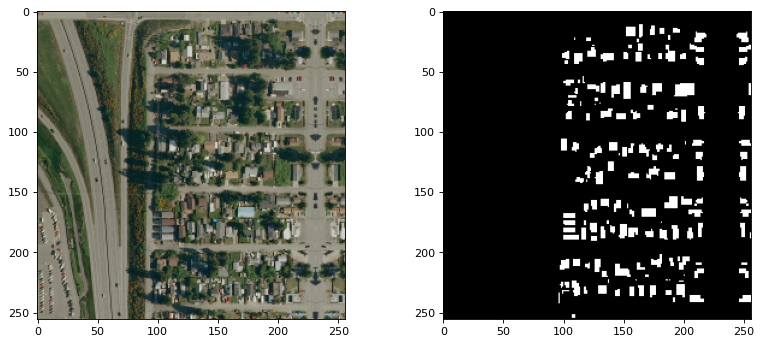
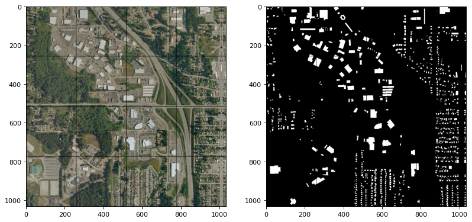

# Tutorial for Using Split-Raster for Deep Learning

This demo we will split a large image into small tiles. It is useful for deep learning and computer vision tasks. The package can also be used to split a large image into small tiles for other applications.

For example, we have a large image of size 1000-by-1000, and we want to split it into 256-by-256 tiles. The `SplitRaster` package successfully generate 16 256x256 images tiles with automatic padding on the edges. You can adjust the tile size and the overlap of the tiles for your own applications.

Setup your local or cloud environment for this demo.

This demo we use the python 3.10, but the package is compatible with python 3.7, 3.8, 3.9, 3.10, 3.11 and 3.12. 

```bash
>pip install -q splitraster
```

## Create Image Sample Pairs

```python
from splitraster import io

input_image_path = "../data/raw/RGB.png"
gt_image_path = "../data/raw/GT.png"

save_path = "../data/processed/RGB"
save_path_gt = "../data/processed/GT"

crop_size = 256
repetition_rate = 0 # <----- change this value to 0.5 for 50% overlap
overwrite = True # <----- change this value to False for no overwrite demo

n = io.split_image(input_image_path, save_path, crop_size,
                   repetition_rate=repetition_rate, overwrite=overwrite)
print(f"{n} tiles sample of {input_image_path} are added at {save_path}")


n = io.split_image(gt_image_path, save_path_gt, crop_size,
                   repetition_rate=repetition_rate, overwrite=overwrite)
print(f"{n} tiles sample of {gt_image_path} are added at {save_path_gt}")
```
Output:
```bash
Input Image File Shape (H, W, D):(1000, 1000, 3)
crop_size = 256, stride = 256
Padding Image File Shape (H, W, D):(1024, 1024, 3)
... 

16 tiles sample of ../data/raw/GT.png are added at ../data/processed/GT
```

## Random Sampling Code

If you want to create a small data set at the early stage for exploaration. Use the random sampling code, you can use the following code. The following code shows to geneate a 20 tiles (256x256) from the 1000x1000 image

```python
from splitraster import io
input_image_path = "../data/raw/RGB.png"
gt_image_path = "../data/raw/GT.png"

input_save_path = "../data/processed/Rand/RGB"  
gt_save_path = "../data/processed/Rand/GT"

n = io.random_crop_image(input_image_path, input_save_path,  gt_image_path, gt_save_path, crop_size=256, crop_number=20, img_ext='.png', label_ext='.png', overwrite=True)

print(f"{n} sample paris of {input_image_path, gt_image_path} are added at {input_save_path, gt_save_path}.")
```

Result:

```bash
Generating: 100%|██████████| 20/20 [00:01<00:00, 19.27img/s]20 sample paris of ('../data/raw/RGB.png', '../data/raw/GT.png') are added at ('../data/processed/Rand/RGB', '../data/processed/Rand/GT').
```


## Use the output of the Split-Raster as the input of the Deep Learning Model

We will use pytorch as the deep learning framework for this demo.

```bash
pip install -q torch torchvision 
```

## Create a DataLoader for the Split-Raster output


```python

import torch
from torch.utils.data import Dataset
from torchvision import datasets
from torchvision.transforms import ToTensor
import matplotlib.pyplot as plt

from skimage.io import imread, imsave
import os 
import numpy as np
```
create the `DatasetSegmentation` class to create a custom dataset class for the deep learning model.
```python
# Create a custom dataset class
class DatasetSegmentation(torch.utils.data.Dataset):
    def __init__(self, image_path, label_path):
        self.imgfolder = image_path
        self.maskfolder = label_path
        self.imgs = list(sorted(os.listdir(image_path)))
        self.masks = list(sorted(os.listdir(label_path)))

    def __getitem__(self, idx):
        img_path = os.path.join(self.imgfolder, self.imgs[idx])
        mask_path = os.path.join(self.maskfolder, self.masks[idx])
        data = imread(img_path)
        data = np.moveaxis(data, -1, 0)
        label = imread(mask_path)
        label = label/255
        return torch.from_numpy(data).float(), torch.from_numpy(label).long()

    def __len__(self):
        return len(self.imgs)
AerialDataset = DatasetSegmentation("../data/processed/RGB", "../data/processed/GT")
```

Create a DataLoader and read a batch of images from the Split-Raster output.

```python
from torch.utils.data import DataLoader
train_dataloader = DataLoader(AerialDataset, batch_size=16, shuffle=False)
train_features, train_labels = next(iter(train_dataloader))
print(f"Feature batch shape: {train_features.size()}")
print(f"Labels batch shape: {train_labels.size()}")
```

Output:

```bash
Feature batch shape: torch.Size([16, 3, 256, 256])
Labels batch shape: torch.Size([16, 256, 256])
```
## Visualize the images and labels.

``` python
# Select 16 random images from the training set
import random
idx = random.randint(0, 15)
img = train_features[idx].squeeze().numpy()
label = train_labels[idx].squeeze().numpy()

print(f"Feature batch shape: {img.shape, img.max(), img.min()}")
print(f"Labels batch shape: {label.shape, label.max(), label.min()}")


from matplotlib.pyplot import figure

figure(figsize=(12, 5), dpi=80)
plt.subplot(1,2,1)
img = np.moveaxis(img, 0, -1) # adjust the channel dimension
plt.imshow(img.astype(np.uint8) )
plt.subplot(1,2,2)

plt.imshow(label.astype(np.uint8), cmap="gray")
plt.show()

```

Feature batch shape: ((3, 256, 256), 221.0, 1.0)
Labels batch shape: ((256, 256), 1, 0)



## Use torchvision to visualize the images and labels

```python
import torchvision
grid_img = torchvision.utils.make_grid(train_features/255, nrow=4)
grid_label = torchvision.utils.make_grid(train_labels.unsqueeze_(1), nrow=4)
print(grid_img.shape)
print(grid_label.shape)
figure(figsize=(12, 18), dpi=80)
plt.subplot(1,2,1)
plt.imshow(grid_img.permute(1, 2, 0))
plt.subplot(1,2,2)
plt.imshow(grid_label[0,:,:], cmap='gray')
plt.show()
```

Output:
```
(torch.Size([3, 1034, 1034]), torch.Size([3, 1034, 1034]))
```



## Download the Notebook

Find the full code in this  Notebook Tutorial: [SplitRaster Tutorial](https://github.com/cuicaihao/split_raster/blob/master/notebooks/Tutorial.ipynb).

--- 

